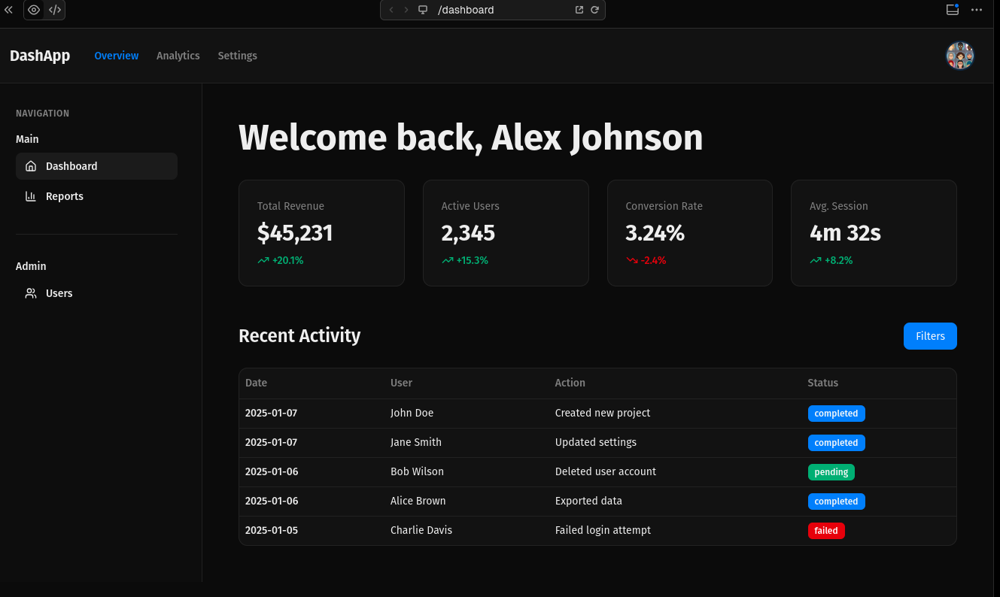

# DoctoSpec

**A natural language grammar for building user interfaces with LLMs and agents**

DoctoSpec is a flexible, English-like specification language designed for AI-assisted UI development. Write UI specifications naturally, and let LLMs interpret them into working code for any framework. Built for the age of AI agents and conversational development.

## Philosophy

- **Natural Language First** - Write specs in plain English, not rigid syntax
- **LLM-Optimized** - Designed for AI agents to parse and generate UIs
- **Flexible Patterns** - Multiple ways to express the same thing
- **Intent-Based** - Focus on what you want, not how to say it
- **Framework Agnostic** - AI generates code for React, Vue, Svelte, HTML, or any framework
- **Complete Toolkit** - From buttons to complex dashboards, all UI patterns included

## Quick Start

Instead of writing code, describe your UI naturally and let an LLM build it:

```doctospec
framework: react
language: typescript
styling: tailwind

create a dashboard page

add a header containing:
  - logo "MyApp"
  - if authenticated, show user menu
  - if not authenticated, show login button → /login

add a hero section
  styled:
    - background: gradient from blue to purple
    - padding: 4rem vertical
    - text alignment: center
  
  containing:
    - heading "Welcome Back" with value userName
    - button "Get Started" triggers startTour

for each product, display:
  - card (repeats in grid, 3 columns on desktop, 1 on mobile)
    containing:
      - image with value product.image
      - heading with value product.name
      - price with value product.price
      - button "Buy Now" triggers addToCart
```

## Why DoctoSpec for LLMs?

### Traditional Approach
```
You: "Create a dashboard with a user menu"
LLM: *generates code directly*
You: "No, the menu should only show for authenticated users"
LLM: *regenerates entire component*
```

### DoctoSpec Approach
```
You: "Create a dashboard with a user menu"
LLM: *generates DoctoSpec*

create a dashboard page
add a header with user menu

You: "Only for authenticated users"
LLM: *updates spec*

add a header containing:
  - if authenticated, show user menu
```

The spec becomes a **shared understanding** between you and the AI.

## Features

### Natural Flexibility

LLMs understand context and synonyms - write however feels natural:

```doctospec
// All of these work:
button "Submit" triggers handleSubmit
button "Submit" that triggers handleSubmit
a submit button calling handleSubmit
submit button → handleSubmit
create a button saying "Submit" which runs handleSubmit
```

### LLM-Friendly Patterns

DoctoSpec uses patterns LLMs already understand from natural language:

**Conditionals**
```doctospec
if logged in, show dashboard
when authenticated, show dashboard
for authenticated users, show dashboard
show dashboard if logged in
authenticated users see dashboard
```

**Loops**
```doctospec
for each product, display:
  - card with product details

foreach item in cart:
  - item row

repeat for all users:
  - user card
```

**Styling**
```doctospec
styled:
  - background: gradient from blue to purple
  - padding: 4rem vertical on desktop, 2rem on mobile
  - on hover: shadow large, transform scale 1.02
```

## Framework & Language Specification

Tell the LLM what to generate by specifying your stack:

```doctospec
framework: react
language: typescript
styling: tailwind

// or

framework: vue
language: javascript
styling: scss

// or

framework: svelte
language: typescript
styling: css-modules

// or

framework: html
language: vanilla-js
styling: css
```

### Configuration Options

```doctospec
framework: [react | vue | svelte | angular | solid | html | react-native | flutter]
language: [typescript | javascript | python | dart | kotlin | swift]
styling: [tailwind | css | scss | sass | styled-components | emotion | css-modules]
build: [vite | webpack | next | nuxt | sveltekit]
state: [zustand | redux | pinia | context | signals]
```

### Full Configuration Example

```doctospec
framework: react
language: typescript
styling: tailwind
build: vite
state: zustand
testing: vitest

styles for this app:
  - primary color: #3B82F6
  - font: Inter, sans-serif
  - spacing: 1rem base unit

create a dashboard page
  ...
```

## Use Cases with LLMs

### Conversational UI Development

**Developer:**
> "I need an e-commerce product page"

**LLM generates DoctoSpec:**
```doctospec
framework: react
language: typescript

create a product page
add a product image gallery
add product details with price and description
add an "Add to Cart" button
```

**Developer:**
> "Add reviews and make it responsive"

**LLM updates spec:**
```doctospec
create a product page
  
section (grid 2 cols on desktop, 1 col on mobile):
  - product gallery (lightbox enabled)
  - product details with price and description
  - "Add to Cart" button triggers addToCart

section reviews:
  for each review, display:
    - review card with rating and comment
```

### Iterative Refinement

Instead of regenerating code, LLMs update the spec:

```
You: "Make the button bigger and primary color"
```

LLM updates:
```doctospec
- button primary large "Add to Cart" triggers addToCart
```

```
You: "Disable it when out of stock"
```

LLM updates:
```doctospec
- button primary large "Add to Cart" triggers addToCart (disabled if not inStock)
```

### Design System Consistency

Define your design language once, LLMs use it everywhere:

```doctospec
styles for this app:
  - primary: #3B82F6
  - secondary: #10B981
  - font: Inter
  - button style: rounded-lg px-6 py-3
  - card style: shadow-lg rounded-xl p-6
```

Every component the LLM generates follows these rules.

### Multi-Framework Translation

Write once in DoctoSpec, ask LLM to generate for different frameworks:

```
You: "Generate this as React"
LLM: *generates React + TypeScript + Tailwind*

You: "Now as Vue"
LLM: *generates Vue SFC with same logic*

You: "Now as vanilla HTML"
LLM: *generates HTML + CSS + vanilla JS*
```

### Agent-Based Development

DoctoSpec works perfectly with AI agents that build UIs:

```python
# Agent workflow
spec = agent.understand_requirements(user_input)
# spec is valid DoctoSpec

validated = agent.validate_spec(spec)
code = agent.generate_code(validated, framework="react")
deployed = agent.deploy(code)
```

## Examples

### Simple Landing Page
See [examples/simple-landing.spec](examples/simple-landing.spec)

### E-commerce Product Page
See [examples/ecommerce.spec](examples/ecommerce.spec)

### Admin Dashboard
See [examples/admin-panel.spec](examples/admin-panel.spec)

### Complete Feature Showcase
See [examples/all-features.spec](examples/all-features.spec)



## Grammar Specification

The formal BNF grammar is available in [doctospec.bnf](doctospec.bnf)

Key principles for LLMs:
- **Minimal reserved keywords** - LLMs recognize intent, not syntax
- **Context-aware parsing** - Indentation and nesting infer structure
- **Synonym support** - "button", "btn", "submit button" all work
- **Flexible word order** - "large red button" = "red button large"
- **Smart defaults** - "email field" implies type and validation
- **Forgiving syntax** - LLMs autocorrect and interpret meaning

## How LLMs Use DoctoSpec

### Pattern Recognition
LLMs recognize intent from natural language:

```doctospec
"I want a login form"
→ LLM generates:

form with fields:
  - email (required)
  - password (required)
  - submit button "Log In" triggers handleLogin
```

### Context Understanding
LLMs infer missing details:

```doctospec
"Add a product card"
→ LLM knows products typically need:

card:
  - image with value product.image
  - heading with value product.name
  - price with value product.price
  - button "View Details" → /products/{product.id}
```

### Framework Adaptation
Same spec, different output based on framework config:

**React:**
```typescript
const ProductCard = ({ product }) => (
  <div className="card">
    
    <h3>{product.name}</h3>
    <p>${product.price}</p>
  </div>
)
```

**Vue:**
```vue
<template>
  <div class="card">
    
    <h3>{{ product.name }}</h3>
    <p>${{ product.price }}</p>
  </div>
</template>
```

## Best Practices for LLM Usage

### Be Conversational
```doctospec
// Good - natural and clear
add a search bar at the top
when user types, filter the results
show a loading spinner while searching

// Also good - more structured
search bar (positioned top)
  on input triggers filterResults (debounced 300ms)
  shows spinner while loading
```

### Iterate, Don't Rewrite
```
User: "Add dark mode support"
LLM: Updates existing spec with theme toggle

User: "Make it remember user preference"  
LLM: Adds localStorage and state management to spec

User: "Animate the transition"
LLM: Adds animation properties to theme switch
```

### Let LLMs Fill Gaps
```doctospec
// You write:
create a user profile page

// LLM expands with common patterns:
create a user profile page

header with:
  - back button → /dashboard
  - page title "Profile"

section containing:
  - avatar with value user.avatar (editable)
  - form with fields:
    - name with value user.name
    - email with value user.email
    - bio textarea with value user.bio
  - save button triggers updateProfile
```

## Prompt Templates for LLMs

### Generating DoctoSpec
```
Generate a DoctoSpec for [description].
Use framework: [react/vue/etc], language: [typescript/javascript], styling: [tailwind/css/etc].
Make it responsive and accessible.
```

### Converting Code to DoctoSpec
```
Convert this [React/Vue/etc] component to DoctoSpec:
[paste code]

Make it framework-agnostic and natural language focused.
```

### Updating Existing Spec
```
Update this DoctoSpec to [change description]:
[paste spec]

Only modify what's necessary, keep the rest unchanged.
```

## Why This Matters

**Traditional LLM UI Generation:**
- LLM generates code directly
- Hard to modify incrementally
- Framework-locked
- Difficult to review/validate
- Inconsistent patterns

**DoctoSpec with LLMs:**
- LLM generates human-readable spec
- Easy to iterate and refine
- Framework-agnostic
- Reviewable by non-developers
- Consistent patterns enforced
- Spec serves as documentation

## Contributing

DoctoSpec is designed to evolve with AI capabilities:

- Additional LLM-friendly patterns
- Framework-specific adapters
- AI agent integration examples
- Validation and testing patterns
- Accessibility enhancements
- Internationalization support

## Philosophy

**Why DoctoSpec for AI Development?**

LLMs are great at understanding intent but can generate inconsistent code. DoctoSpec provides:

- **A common language** between humans and AI
- **Iterative refinement** without full rewrites
- **Framework flexibility** without retraining
- **Human readability** for review and modification
- **Consistency** across AI-generated UIs

**The spec is the interface between human intent and AI execution.**

## License

MIT

---

**DoctoSpec** - Write UI specs like you talk. Let AI build what you mean.
